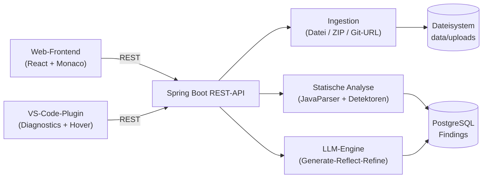

# Automatischer Code-Reviewer

Der **Automatische Code-Reviewer** ist ein intelligentes Review-Werkzeug, das hochgeladenen Java-Code sowohl über eine deterministische statische Analyse (AST-basiert via JavaParser) als auch über ein fortschrittliches LLM-gestütztes Review (Claude API mit dem "Generate-Reflect-Refine"-Ansatz) bewertet. Die Ergebnisse (Code-Smells, logische Fehler, Verbesserungsvorschläge) werden interaktiv im Web-Frontend (Monaco Editor mit Markierungen) sowie direkt in der VS-Code-Entwicklungsumgebung angezeigt.

---

## 🛠️ Tech-Stack

### Backend
* **Sprache & Laufzeit:** Java 21 (OpenJDK Temurin)
* **Framework:** Spring Boot 3.3.x
* **Build-Tool:** Gradle 9 (Kotlin DSL)
* **Datenbank & Persistenz:** PostgreSQL 16, Spring Data JPA, Flyway für Migrationen
* **Code-Analyse:** JavaParser (für AST-basierte statische Smells)
* **LLM-Integration:** Anthropic Claude API (per HttpClient / RestClient)

### Frontend
* **Framework:** React 18+ mit Vite & TypeScript
* **Editor:** Monaco Editor (für native Code-Hervorhebung und Finding-Markierungen)
* **Styling:** Vanilla CSS (modernes UI-Design mit Dark Mode und harmonischen Paletten)

### VS-Code-Plugin
* **Laufzeit:** Node.js, VS Code Extension API
* **Funktion:** Triggerung von Reviews und Visualisierung über native VS-Code-Diagnostics (Squiggly Lines) und Hovers.

---

## 📁 Repository-Struktur (Monorepo)

```text
code-reviewer/
├── .github/
│   ├── workflows/           # CI/CD Pipelines (GitHub Actions)
│   └── pull_request_template.md
├── backend/                 # Spring Boot Backend (Gradle)
│   ├── config/              # Checkstyle-Konfigurationen
│   ├── gradle/wrapper/      # Gradle Wrapper-Dateien
│   ├── src/                 # Modularer Java-Quellcode & Migrationen
│   ├── build.gradle.kts     # Gradle-Buildskript
│   ├── settings.gradle.kts  # Gradle-Settings
│   ├── gradlew / gradlew.bat # Gradle Wrapper-Ausführungsdateien
│   └── Dockerfile           # Multi-Stage-Build (Gradle -> JRE-Image)
├── frontend/                # React Web-App (Vite)
│   ├── src/                 # React Komponenten & Assets
│   ├── .prettierrc          # Prettier Formatierungsregeln
│   ├── package.json         # NPM Scripts & Dependencies
│   └── Dockerfile           # Multi-Stage-Build (Vite-Build -> nginx)
├── vscode-extension/        # VS-Code-Plugin (TypeScript)
│   ├── src/                 # Extension-Code (Command-Handler, API-Client)
│   ├── test/                # Vitest-Tests für den API-Client
│   └── package.json         # Extension-Manifest & NPM Scripts
├── demo/src/                # Beispielprojekt mit bewusst eingebauten Findings
├── docs/DEMO.md             # Ablaufplan für die Abschlusspräsentation
├── docker-compose.yml       # Postgres + Backend + Frontend als Container
└── README.md                # Projektdokumentation
```


### ☕ Backend-Architektur & Paketstruktur
Das Backend ist als **Modularer Monolith** (Package-by-Feature) aufgebaut, um eine saubere Kapselung der Komponenten und konfliktfreie parallele Entwicklung im Team zu gewährleisten:
* `de.ude.codereviewer.project`: Verwaltet die Projekte und REST-APIs für das Projektmanagement.
* `de.ude.codereviewer.review`: Verwaltet die Review-Läufe (`ReviewRun`) und Analysebefunde (`Finding`).
* `de.ude.codereviewer.ingestion`: Verwaltet den Import und die Validierung von hochgeladenem Code (Dateien/ZIPs).
* `de.ude.codereviewer.analysis`: Enthält die Schnittstellen und Implementierungen der Analyse-Engines (AST Parser & LLM Reflection Agent).

---

## 🏗️ Architektur im Überblick

Beide Clients (Web-Frontend und VS-Code-Plugin) sprechen dieselbe REST-API – es gibt keine
Analyse-Logik im Client. Dadurch verhalten sich beide Oberflächen automatisch gleich, und neue
Analyse-Fähigkeiten im Backend erscheinen ohne Client-Änderung in beiden.



### Ablauf eines Reviews

1. **Projekt anlegen** – ein `Project` gruppiert alle Review-Läufe einer Codebasis.
2. **Code hochladen** – Einzeldatei, ZIP-Archiv oder öffentliche Git-URL. Die Ingestion validiert
   (Format, Größe, Zip-Slip, Zip-Bomb, SSRF bei Git-URLs) und legt den Code unter `data/uploads/{reviewRunId}/` ab.
   Es entsteht ein `ReviewRun` mit Status `IN_PROGRESS` → `COMPLETED` bzw. `FAILED`.
3. **Analyse auslösen** – der gespeicherte Code wird per JavaParser zu einem AST geparst; darauf
   laufen die Smell-Detektoren (lange Methoden, tiefe Verschachtelung, ungenutzte Variablen).
4. **Findings speichern** – alle Befunde werden im einheitlichen `Finding`-Format persistiert
   (Datei, Zeile, Kategorie, Schweregrad, Begründung, Vorschlag). Genau dieses Format nutzen
   später auch die LLM-Findings, damit beide Quellen ohne Sonderfälle zusammenfließen.
5. **Anzeigen** – Frontend und VS-Code-Plugin lesen dieselben Findings und stellen sie in ihrer
   jeweils nativen Form dar (Monaco-Markierungen bzw. VS-Code-Diagnostics).

---

## 🔌 REST-API-Referenz

| Methode | Pfad | Zweck |
|---|---|---|
| `POST` | `/api/projects` | Projekt anlegen (`{"name": "..."}`) |
| `GET` | `/api/projects` | Alle Projekte auflisten |
| `GET` | `/api/projects/{id}` | Einzelnes Projekt abrufen |
| `POST` | `/api/projects/{projectId}/review-runs` | Code hochladen (`multipart/form-data`, Feld `file`: `.java` oder `.zip`) |
| `POST` | `/api/projects/{projectId}/review-runs/from-git` | Öffentliches Repo importieren (`{"repositoryUrl": "https://..."}`) |
| `GET` | `/api/projects/{projectId}/review-runs` | Review-Läufe eines Projekts auflisten |
| `GET` | `/api/projects/{projectId}/review-runs/{id}` | Einzelnen Review-Lauf abrufen |
| `GET` | `/api/projects/{projectId}/review-runs/{id}/ast` | AST-Parse-Report (Typen-/Methodenzahl je Datei) |
| `GET` | `/api/projects/{projectId}/review-runs/{id}/smells` | Smells berechnen, ohne zu speichern |
| `POST` | `/api/projects/{projectId}/review-runs/{id}/findings` | Analyse ausführen und Findings persistieren |
| `GET` | `/api/projects/{projectId}/review-runs/{id}/findings` | Gespeicherte Findings abrufen |
| `GET` | `/actuator/health` | Health-Check (inkl. DB-Verbindung) |

Fehler liefern durchgängig ein einheitliches JSON (`timestamp`, `status`, `error`, `message`) über
den zentralen `GlobalExceptionHandler` – u. a. `400` bei ungültigen Uploads, `404` bei unbekannten
IDs, `409` wenn ein Review-Lauf keinen gespeicherten Quellcode hat.

---


## 🚀 Erste Schritte / Lokale Entwicklung

### Voraussetzungen
Stelle sicher, dass folgende Software auf deinem Rechner installiert ist:
* **Java 21** (z. B. Eclipse Temurin)
* **Node.js** (v18 oder neuer) & `npm`
* **Docker** & **Docker Compose**
* **Visual Studio Code** (nur fürs VS-Code-Plugin, siehe Schritt 4)
* **GitHub CLI (gh)** (falls du das Backlog importieren möchtest)

---

### Schnellstart: alles über Docker Compose

Am schnellsten testest du Backend + Frontend zusammen mit einem einzigen Befehl im Projekt-Root
(keine lokale Java-/Node-Installation nötig, nur Docker).

**Was du vorher tun musst:**

1. **Docker Desktop starten** und warten, bis es läuft (`docker info` liefert keinen Fehler).
2. *(Optional, für KI-Review)* Anthropic-API-Schlüssel in der aktuellen Shell setzen – **vor** dem
   `docker compose up`, damit der Backend-Container ihn übernimmt. Ohne Schlüssel läuft alles, nur
   ohne LLM-Findings (siehe [Abschnitt 2.1](#21-llm-api-schlüssel-konfigurieren-optional)).

   ```powershell
   # PowerShell (Windows)
   $env:LLM_API_KEY = "sk-ant-..."
   ```
   ```bash
   # bash (macOS/Linux)
   export LLM_API_KEY="sk-ant-..."
   ```

3. **Stack bauen und starten** (im Projekt-Root):

   ```bash
   docker compose up --build
   ```

Das startet drei Container:
* **PostgreSQL** – Port `5432` (Datenbank `codereviewer`, User `postgres`, Passwort `password`)
* **Backend** (Spring Boot) – `http://localhost:8080`
* **Frontend** (React, per nginx ausgeliefert) – `http://localhost:5173`

**Bereit?** Warte, bis `curl http://localhost:8080/actuator/health` `{"status":"UP"}` liefert –
dann Frontend unter `http://localhost:5173` öffnen. Zum Ausprobieren `demo/demo-project.zip`
hochladen (siehe [`docs/DEMO.md`](docs/DEMO.md)).

Zum Beenden: `Strg+C`, danach `docker compose down` (Datenbank-Inhalt bleibt im Volume `pgdata` erhalten,
hochgeladener Code im Volume `backend-uploads`; `docker compose down -v` löscht auch diese Volumes).

*Hinweis:* Das erste `--build` lädt Basis-Images herunter und baut Backend (Gradle) sowie Frontend
(Vite) – je nach Internetverbindung kann das ein paar Minuten dauern. Spätere Starts (ohne Code-Änderung)
gehen mit `docker compose up` (ohne `--build`) deutlich schneller.

Wenn du stattdessen mit Hot-Reload lokal entwickeln willst (Code-Änderungen sofort sehen, ohne Neubau),
nutze die Schritte 1–3 unten statt Docker Compose.

---

### 1. Datenbank starten
Die PostgreSQL-Datenbank wird vorkonfiguriert über Docker Compose bereitgestellt:

```bash
docker compose up -d postgres
```
*Die Datenbank läuft auf Port `5432` mit der Datenbank `codereviewer` (User: `postgres`, Passwort: `password`).*

---

### 2. Backend starten
Navigiere in den Backend-Ordner und starte die Spring-Boot-Anwendung:

```bash
cd backend
# Falls kein lokales Gradle installiert ist, nutze den Wrapper (wird beim ersten Setup generiert):
./gradlew bootRun
```
*Das Backend läuft unter `http://localhost:8080`.*

---

### 2.1 LLM-API-Schlüssel konfigurieren (optional)

Das Backend unterstützt optionale KI-gestützte Code-Reviews über die Anthropic Claude API. Ohne einen API-Schlüssel werden **nur die statischen AST-Analysen** (lange Methoden, tiefe Verschachtelung, ungenutzte Variablen) ausgeführt – das Tool funktioniert ansonsten vollständig.

**So richtest du den LLM-Review ein:**

1. Einen API-Schlüssel bei [console.anthropic.com](https://console.anthropic.com/) erstellen.

2. Beim Starten des Backends die Umgebungsvariable `LLM_API_KEY` setzen:

```bash
# Variante A: Lokaler Start (Host), direkt beim Befehl (bash)
LLM_API_KEY="sk-ant-..." ./gradlew bootRun

# Variante B: Lokaler Start (Host), vorher exportieren
export LLM_API_KEY="sk-ant-..."   # bash
./gradlew bootRun
```

```powershell
# Variante A/B unter Windows PowerShell
$env:LLM_API_KEY = "sk-ant-..."
.\gradlew bootRun
```

```bash
# Variante C: Docker Compose – Schlüssel in der Shell setzen, dann starten.
# docker-compose.yml reicht LLM_API_KEY über ${LLM_API_KEY:-} an den Backend-Container durch;
# ist die Variable nicht gesetzt, bleibt sie leer (nur AST).
export LLM_API_KEY="sk-ant-..."       # bzw. $env:LLM_API_KEY = "sk-ant-..." in PowerShell
docker compose up --build
```

3. Das Backend erkennt den Schlüssel automatisch und aktiviert den LLM-Review für alle hochgeladenen Projekte.
   Kontrolle: `docker compose logs backend | grep LLM` – erscheint `LLM API key not configured`, ist kein
   Schlüssel angekommen; ohne diese Meldung läuft der LLM-Review.

**Weitere LLM-Einstellungen** (in `application.yml` unter `codereviewer.llm` konfigurierbar):

| Variable | Standard | Beschreibung |
|---|---|---|
| `LLM_API_KEY` | *(leer)* | Anthropic API-Schlüssel |
| `codereviewer.llm.model` | `claude-sonnet-4-5` | Claude-Modell |
| `codereviewer.llm.daily-token-budget` | `200000` | Tägliches Token-Limit |
| `codereviewer.llm.max-tokens-per-call` | `2048` | Maximale Tokens pro API-Call |
| `codereviewer.llm.cache-enabled` | `true` | Ergebnisse zwischenspeichern |

> **Hinweis:** Ohne `LLM_API_KEY` überspringt das Backend LLM-Aufrufe komplett (kein Fehler, nur Info-Log). Die tokenbasierte Budgetbegrenzung schützt vor unbegrenztem API-Verbrauch.

---

### 3. Frontend starten
Navigiere in den Frontend-Ordner, installiere die Abhängigkeiten und starte den Entwicklungsserver:

```bash
cd frontend
npm install
npm run dev
```
*Das Frontend läuft unter `http://localhost:5173`.*

---

### 4. VS-Code-Plugin nutzen

**Voraussetzung:** Das Backend muss laufen (Schritte 1+2 oben, erreichbar unter `http://localhost:8080`).
Das Plugin macht sonst nichts – es hat keine eigene Analyse-Logik, sondern spricht nur die Backend-API an.

#### 4.1 Installieren

```bash
cd vscode-extension
npm install
npm run compile
```

`npm test` führt die Unit-Tests aus (Vitest), falls du die Logik separat prüfen willst.

#### 4.2 Starten

Zwei Wege, eine **Extension-Development-Host**-Instanz (ein zweites VS-Code-Fenster mit aktivem Plugin) zu öffnen:

**Variante A – über VS Code (F5):**

1. Ordner `vscode-extension/` in VS Code öffnen.
2. `F5` drücken (oder Debug-Ansicht → „Run Extension"). Kompiliert automatisch vorher (`npm run compile` als `preLaunchTask`).
3. Es öffnet sich ein neues Fenster mit lila Titelleiste – das ist der Extension-Development-Host.

**Variante B – per Kommandozeile (schneller, z. B. für Demos):**

```bash
code --extensionDevelopmentPath="<Pfad-zu-vscode-extension>" "<Pfad-zu-einer-.java-Datei>"
```

Braucht die `code`-CLI im PATH (VS Code → Command Palette → „Shell Command: Install 'code' command in PATH").
Öffnet direkt ein Extension-Development-Host-Fenster mit der angegebenen Datei bereits offen.
Im Ordner `vscode-extension/sample/Demo.java` liegt eine Testdatei mit bewusst eingebauten Findings
(lange Methode, tiefe Verschachtelung, ungenutzte Variable) – gut geeignet zum Ausprobieren.

#### 4.3 Benutzen

Im Extension-Development-Host-Fenster:

1. Eine `.java`-Datei öffnen (falls noch nicht offen).
2. Command Palette öffnen: `Strg+Shift+P` (Windows/Linux) bzw. `Cmd+Shift+P` (macOS).
3. **„Code Reviewer: Review starten"** ausführen.
4. Datei wird hochgeladen und analysiert (Fortschritt als Notification unten rechts).
5. Ergebnis:
   * **Squiggly Lines** direkt im Code, farbig nach Schweregrad (Error/Warning/Information).
   * **Problems-Panel** (`Strg+Shift+M`) listet alle Findings der Datei.
   * **Hover** über eine markierte Zeile zeigt Kategorie, Schweregrad, Begründung und Verbesserungsvorschlag.
   * **Quick-Fix** (Glühbirnen-Symbol oder `Strg+.` auf der markierten Zeile):
     * bei „ungenutzte Variable" – löscht die Zeile direkt.
     * bei allen anderen Findings – fügt den Vorschlag als `// TODO(Code Reviewer): ...`-Kommentar ein.

#### 4.4 Konfiguration

Einstellung `codeReviewer.apiBaseUrl` (Standard: `http://localhost:8080`) – anpassen unter
VS-Code-Settings (`Strg+,`) → nach „Code Reviewer" suchen, falls das Backend auf einem anderen Host/Port läuft.

#### 4.5 Aktuelle Einschränkungen

* Nur einzelne `.java`-Dateien (die gerade aktive Datei), keine ganzen Ordner/Projekte über den Command.
* Quick-Fix mit echtem Code-Edit gibt es nur für „ungenutzte Variable"; alle anderen Kategorien bekommen
  einen TODO-Kommentar statt eines automatischen Fixes, weil sich deren Vorschläge nicht sicher automatisch
  umsetzen lassen (z. B. „Methode aufteilen").

---

## 🧪 Tests

```bash
cd backend
./gradlew test          # Backend: JUnit 5 + Mockito + Checkstyle
```

Die Unit-Tests der Kernlogik (`ProjectServiceTest`, `ReviewRunServiceTest`,
`FileSystemCodeStorageServiceTest`, Detektor- und AST-Tests) laufen **ohne Datenbank**.
Die Controller-Tests sind Integrationstests (`@SpringBootTest`) und benötigen ein laufendes
PostgreSQL – dafür vorher `docker compose up -d postgres` starten.

Die CI-Pipeline (GitHub Actions) führt Backend-Build inkl. Tests, Frontend-Build und den
Build/Test des VS-Code-Plugins bei jedem Pull Request aus.

---

## 🎬 Demo / Abschlusspräsentation

Unter [`docs/DEMO.md`](docs/DEMO.md) liegt ein vollständiger Ablaufplan für eine Live-Vorführung
(Vorbereitung, Reihenfolge, erwartete Findings, Fallback-Plan). Das zugehörige Beispielprojekt in
`demo/src/` enthält bewusst platzierte Probleme, sodass jede Kernfähigkeit genau einmal sichtbar wird.

---

## 🗺️ Meilensteine (Roadmap)

* 🏁 **M1 - Fundament (Woche 1):** Repository-Setup, Spring-Boot- und React-Skeleton, Datenbank-Anbindung und erste REST-APIs.
* 🧠 **M2 - Core Engine (Woche 2):** Reflection-Agent (Generate-Reflect-Refine-Zyklus), AST-Analyse (JavaParser) und Persistenz der Ergebnisse.
* 🖥️ **M3 - Web-Frontend (Woche 3):** Upload-Schnittstelle, Monaco Editor-Integration mit farbiger Markierung und Hover-Details der Findings.
* 🔌 **M4 - Plugin & Politur (Woche 4):** VS-Code-Plugin-Integration, automatisierte Tests, Dokumentation und Vorbereitung der Abschlusspräsentation.
